# Deribit NinjaTrader Adapter

[NinjaTrader](https://ninjatrader.com/) is a desktop application which allows trading. It also supports addons to allow third parties integrate their market data into the application.

Deribit NinjaTrader Adapter provides data from [Deribit](https://www.deribit.com/) platform which is bitcoin futures and options exchange. We provide live data, which can be used for analyzis, but we do not support trading.

## Installation

1. Download [Deribit NinjaTrader Adapter](https://github.com/deribit/deribit-ninjatrader-addon/releases/download/v1.0.0/DeribitNinjaTrader-addon-v1.0.0.zip)
2. Start NinjaTrader
3. Open Tools Menu

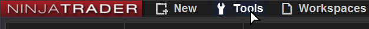

4. Choose Import -> NinjaScript Add-On...

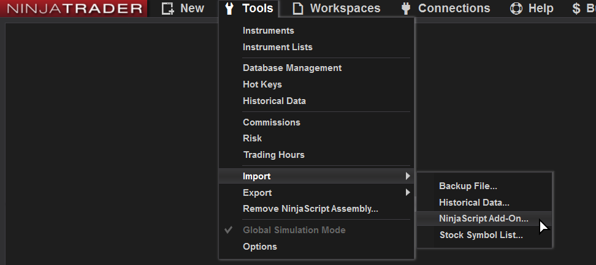

5. Choose zip file with Deribit NinjaTrader Adapter which you downloaded earlier
6. Restart NinjaTrader

## Setup Connection

1. Open Connections Menu

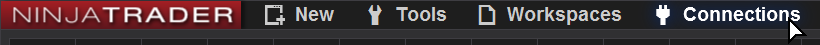

2. Click configure

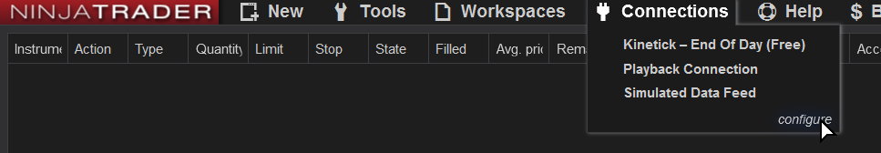

3. Choose deribit from Available list

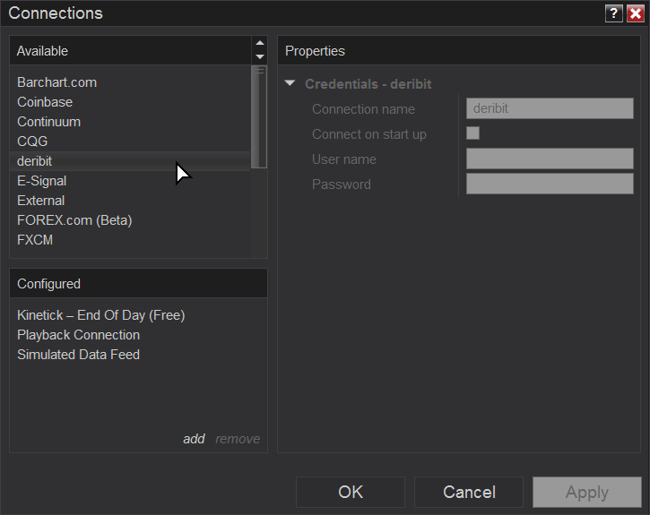

4. Click add in Configured section

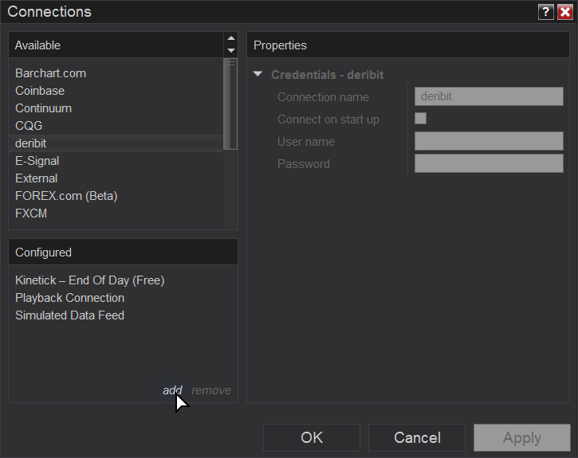

5. Fill properties. You can change Connection name if you wish. You have to fill User name and Password fields, it is required by NinjaTrader, but our addon do not use them, so you can type anything, for example test. Click OK to create new connection.

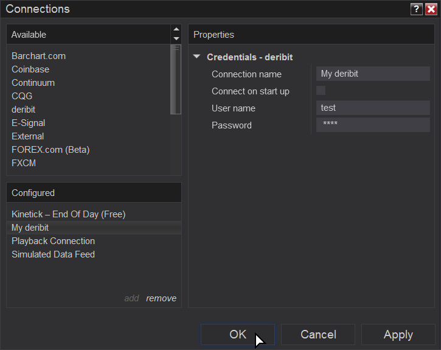

## Connecting

1. Open Connections Menu

2. Click "My deribit"

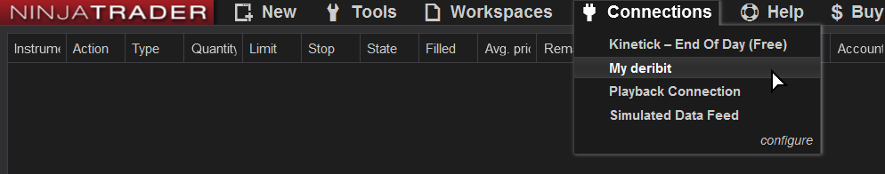

## Setup Instruments

1. Open Tools Menu

2. Choose Instrument Lists

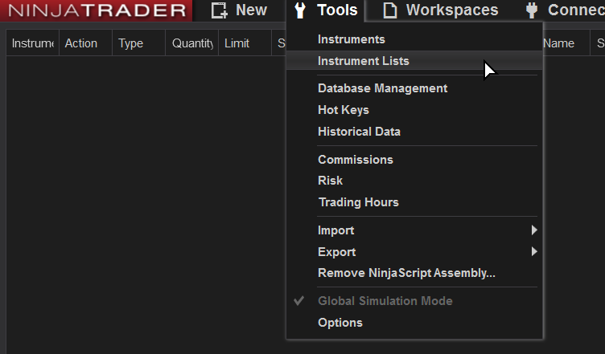

3. Click add in Lists section to create new list

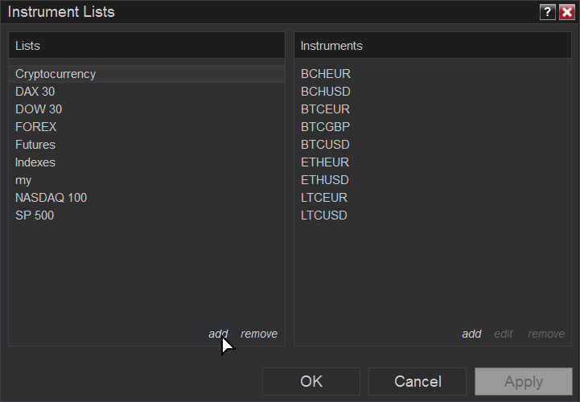

4. Type Deribit and click OK

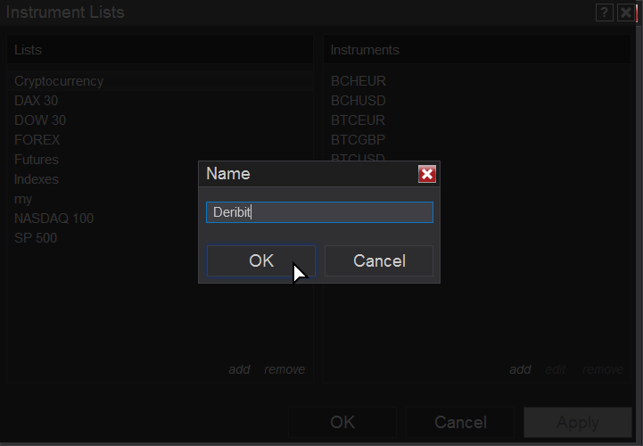

5. Deribit list will be created and selected. Click add in Instruments section to add instruments to list

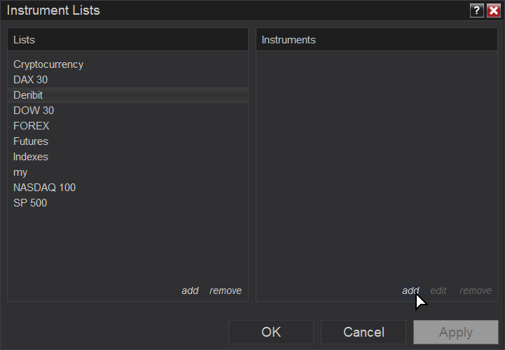

6. Type DERIBIT and **click into magnifier**

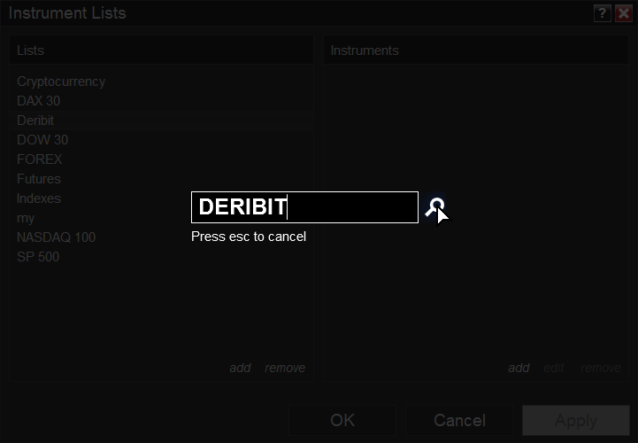

7. Choose instrument which you want to add

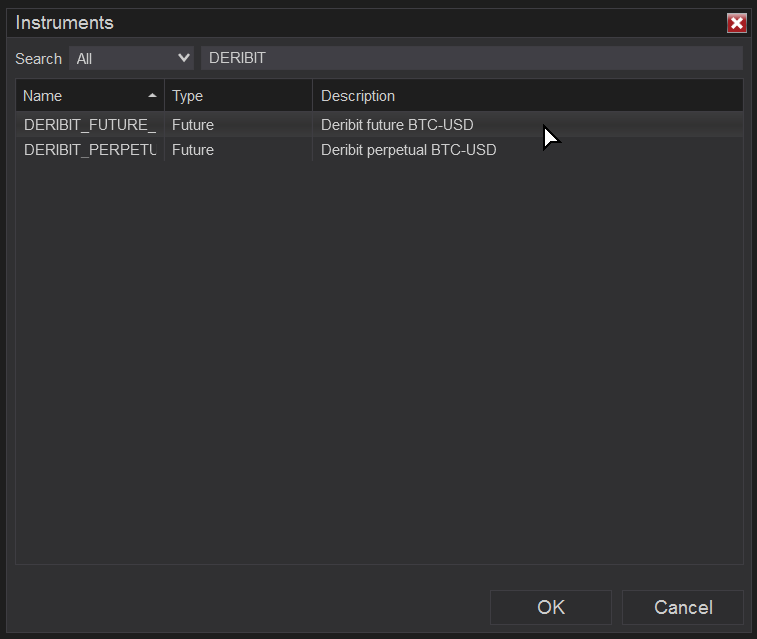

8. Click OK

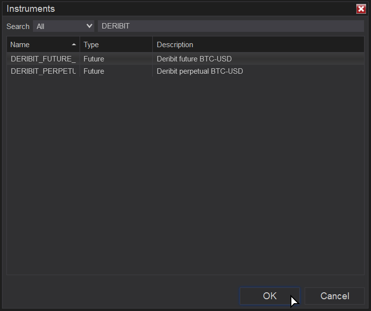

9. Instrument will be added to list. Last digits in instrument name determine when an instrument expires (09-18 means september 2018).

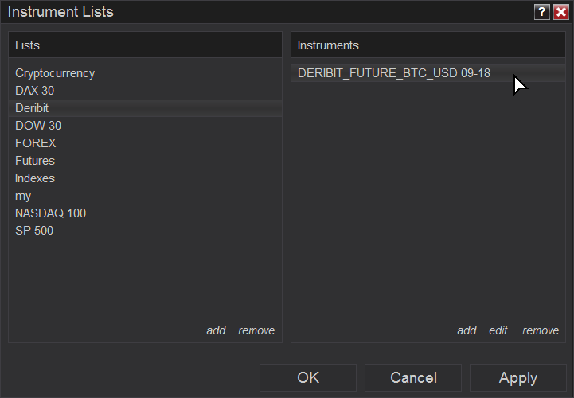

10. If you want to change instrument's rollover click edit.

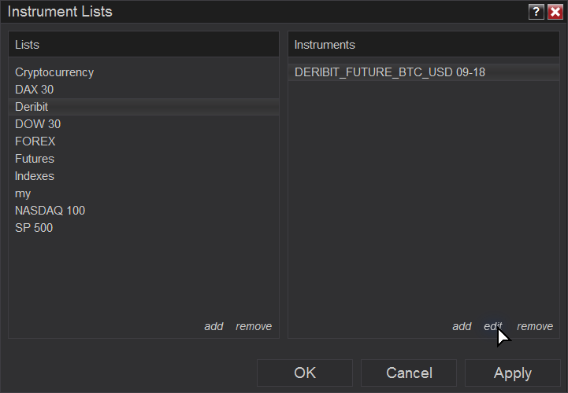

11. Click Expiry

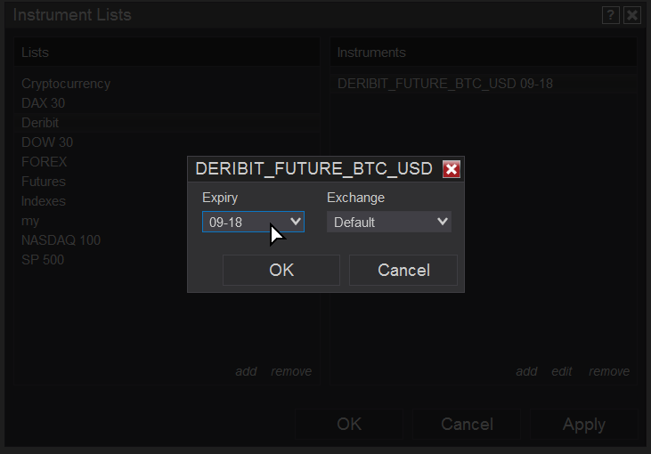

12. And select another one

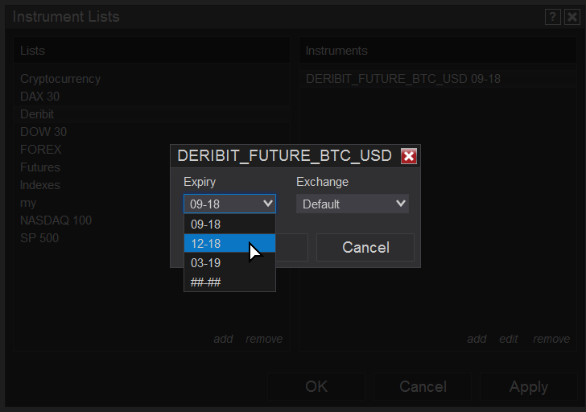

13. Click OK

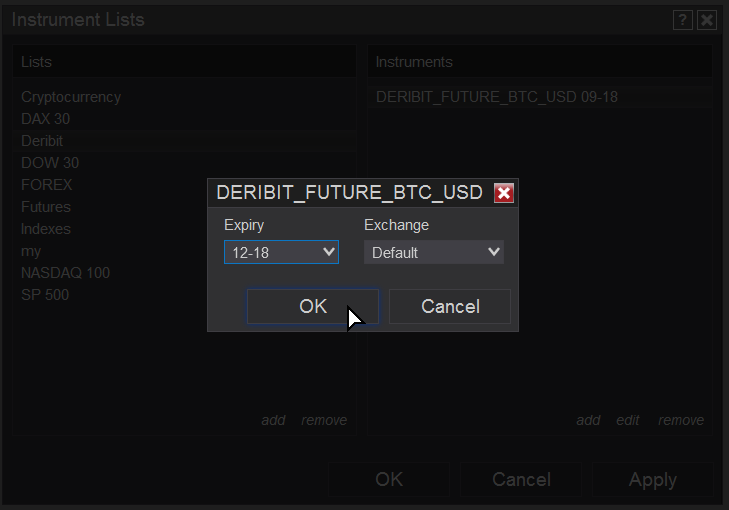

14. Now the instrument has changed rollover

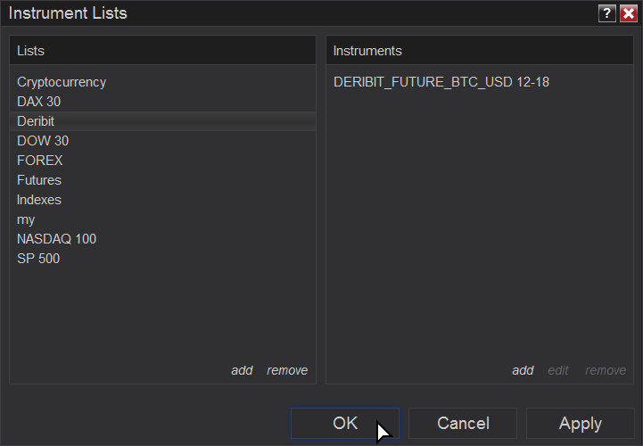

15. You can add another instruments for example DERIBIT_PERPETUALBTC_USD or another DERIBIT_FUTURE_BTC_USD with different rollover. When you finish click OK to commit changes.

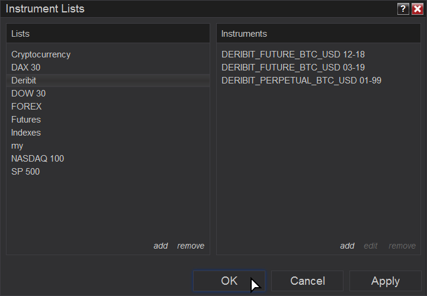

## Supported features

Deribit provide Level I & II data and historical data for charts, so you can use data provided by Deribit in following windows:

- SuperDOM (Dynamic/Static)
- Chart
- Level II
- T & S

## Uninstalling

1. Open Tools Menu

2. Choose Remove NinjaScript Assembly...

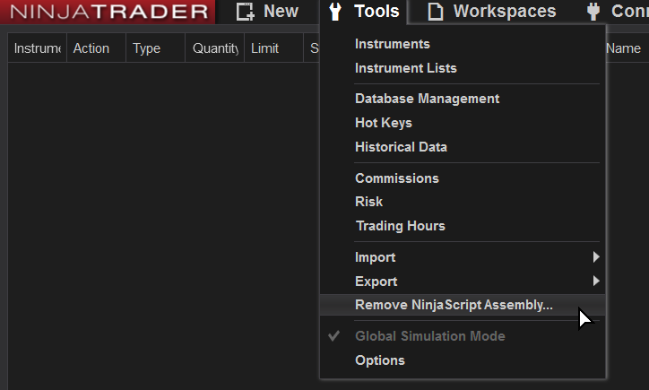

3. Choose Deribit Assembly
